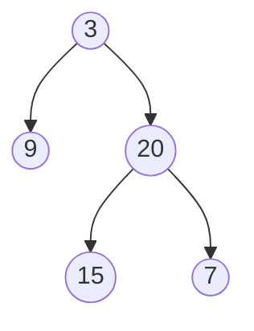

#### 题目描述

给定一个二叉树，找出其最大深度。

二叉树的深度为根节点到最远叶子节点的最长路径上的节点数。

说明: 叶子节点是指没有子节点的节点。

示例：

给定二叉树 [3,9,20,null,null,15,7]

返回它的最大深度 3 。

#### 题目解析

**递归方法**

* 如果一棵树只有一个结点，则树的深度为1；
* 只存在左子树或者右子树，则相应深度+1；
* 同时存在左子树、右子树，则递归遍历左右子树，最终取最大值。

**广度优先搜索(breadth first search)**

广度优先搜索，采用队列的方式存储节点，搜索步骤一般分为一下几步：

1. 在队列中，取出根节点；
2. 检查根节点的左右子树是否满足产生新节点。满足条件则依次进入队列，不满足则弃之；
3. 再依次检查第二层进行第2步操作，直到遍历完整棵树。

